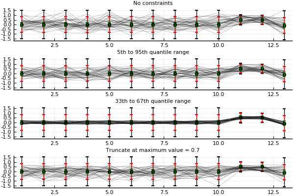

# `UncertainDataset`

Collections of uncertain values are resampled by element-wise sampling the 
furnishing distributions of the uncertain values in the collection. You may sample the collection as it is, or apply [sampling constraints](../sampling_constraints/available_constraints.md) that limit the 
support of the individual data value distributions.

The following methods will work for any collection type included in the [`UVAL_COLLECTION_TYPES`](@ref) type union.

## Single realisation

### No constraint

```@docs
resample(::UVAL_COLLECTION_TYPES)
```

## Same constraint applied to all values

```@docs
resample(::UVAL_COLLECTION_TYPES, ::SamplingConstraint)
```

## Different constraints applied to each value

```@docs
resample(x::UVAL_COLLECTION_TYPES, constraint::Vector{<:SamplingConstraint})
```

## Multiple realisations

### No constraint

```@docs
resample(::UVAL_COLLECTION_TYPES, ::Int)
```

### Same constraint applied to all values

```@docs
resample(::UVAL_COLLECTION_TYPES, ::SamplingConstraint, ::Int)
```

## Different constraints applied to each value

```@docs
resample(x::UVAL_COLLECTION_TYPES, constraint::Vector{<:SamplingConstraint}, n::Int)
```

## Examples

### Resampling with sampling constraints

Consider the following example where we had a bunch of different measurements. 

The first ten measurements (`r1`) are normally distributed values with mean `μ = 0 ± 0.4` 
and standard deviation `σ = 0.5 ± 0.1`. The next measurement `r2` is actually a sample 
consisting of 9850 replicates. Upon plotting it, we see that it has some complex 
distribution which  we have to estimate using a kernel density approach (calling 
`UncertainValue` without any additional argument triggers kernel density estimation). 
Next, we have distribution `r3` that upon plotting looks uniform, so we approximate it by a 
uniform distribution. Finally, the last two uncertain values `r4` and `r5` are represented 
by a normal and a gamma distribution with known parameters.

To plot these data, we gather them in an `UncertainDataset`.

```julia
dist1 = Uniform(-0.4, 0.4)
dist2 = Uniform(-0.1, 0.1)
r1 = [UncertainValue(Normal, 0 + rand(dist), 0.5 + rand(dist2)) for i = 1:10]
 # now drawn from a uniform distribution, but simulates 
r2 = UncertainValue(rand(9850))
r3 = UncertainValue(Uniform, rand(10000))
r4 = UncertainValue(Normal, -0.1, 0.5)
r5 = UncertainValue(Gamma, 0.4, 0.8)

uvals = [r1; r2; r3; r4; r5]
udata = UncertainDataset(uvals);
```

By default, the plot recipe for uncertain datasets will plot the median value with the 
33rd to 67th percentile range (roughly equivalent to a one standard deviation for 
normally distributed values). You may change the percentile range by providing a two-element
vector to the plot function.

Let's demonstrate this by creating a function that plots the uncertain values with 
errors bars covering the 0.1st to 99.9th, the 5th to 95th, and the 33rd to 67th percentile 
ranges. The function will also take a sampling constraint, then resample the dataset 
a number of times and plot the individual realizations as lines. 

```julia
using UncertainData, Plots

function resample_plot(data, sampling_constraint; n_resample_draws = 40) 
    p = plot(lw = 0.5)
    scatter!(data, [0.001, 0.999], seriescolor = :black)
    scatter!(data, [0.05, 0.95], seriescolor = :red)
    scatter!(data, [0.33, 0.67], seriescolor = :green)

    plot!(resample(data, sampling_constraint, n_resample_draws), 
        lc = :black, lw = 0.3, lα = 0.5)
    return p
end

# Now, resample using some different constraints and compare the plots
p1 = resample_plot(udata, NoConstraint())
title!("No constraints")
p2 = resample_plot(udata, TruncateQuantiles(0.05, 0.95))
title!("5th to 95th quantile range")
p3 = resample_plot(udata, TruncateQuantiles(0.33, 0.67))
title!("33th to 67th quantile range")
p4 = resample_plot(udata, TruncateMaximum(0.7))
title!("Truncate at maximum value = 0.7")

plot(p1, p2, p3, p4, layout = (4, 1), titlefont = font(8))
```

This produces the following plot:



### What happens when applying invalid constraints to a dataset?

In the example above, the resampling worked fine because all the constraints were 
applicable to the data. However, it could happen that the constraint is not applicable 
to all uncertain values in the dataset. For example, applying a `TruncateMaximum(2)` 
constraint to an uncertain value `u` defined by `u = UncertainValue(Uniform, 4, 5)` would 
not work, because the support of `u` would be empty after applying the constraint.

To check if a constraint yields a nonempty truncated uncertain value, use the 
`support_intersection` function. If the result of ``support_intersection(uval1, uval2)` 
for two uncertain values `uval1` and `uval2` is the empty set `∅`, then you'll run into 
trouble.

To check for such cases for an entire dataset, you can use the 
`verify_constraints(udata::AbstractUncertainValueDataset, constraint::SamplingConstraint)` 
function. It will apply the constraint to each value and return the indices of the values 
for which applying the constraint would result in a furnishing distribution whose support 
is the empty set.