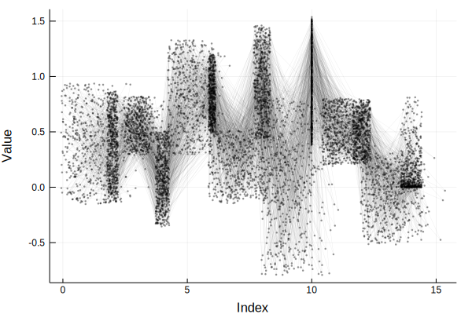

Resampling `UncertainIndexValueDataset`s is done in the same manner as for uncertain 
values and `UncertainDatasets`. 

See also the list of 
[available sampling constraints](../sampling_constraints/available_constraints.md).

## Documentation

### No constraints
```@docs
resample(udata::UncertainIndexValueDataset) 
```

```@docs
resample(udata::UncertainIndexValueDataset, n::Int) 
```

### Same constraint to both indices and data values
```@docs
resample(udata::UncertainIndexValueDataset, 
        constraint::Union{SamplingConstraint, Vector{SamplingConstraint}})
```

```@docs
resample(udata::UncertainIndexValueDataset, 
	constraint::Union{SamplingConstraint, Vector{SamplingConstraint}},
        n::Int)
```

### Different constraints to indices and data values

```@docs
resample(udata::UncertainIndexValueDataset, 
	constraint_idxs::Union{SamplingConstraint, Vector{SamplingConstraint}}, 
	constraint_vals::Union{SamplingConstraint, Vector{SamplingConstraint}})
```

```@docs
resample(udata::UncertainIndexValueDataset, 
	constraint_idxs::Union{SamplingConstraint, Vector{SamplingConstraint}}, 
	constraint_vals::Union{SamplingConstraint, Vector{SamplingConstraint}},
        n::Int)
```

## Examples 

### Same constraint for all uncertain values

First, let's define some data to work on.

```julia 
using UncertainData, Plots 
gr()
r1 = [UncertainValue(Normal, rand(), rand()) for i = 1:10]
r2 = UncertainValue(rand(10000))
r3 = UncertainValue(Uniform, rand(10000))
r4 = UncertainValue(Normal, -0.1, 0.5)
r5 = UncertainValue(Gamma, 0.4, 0.8)

u_values = [r1; r2; r3; r4; r5]
u_timeindices = [UncertainValue(Normal, i, rand(Uniform(0, 1))) for i = 1:length(u_values)]
uindices = UncertainDataset(u_timeindices);
udata = UncertainDataset(u_values);

# Now, gather uncertain indices and uncertain data values
x = UncertainIndexValueDataset(uindices, udata)
```

By default, the plot recipe shows the median and 33rd to 67th percentile range error bars. 
Let's use the default plot recipe, and add some line plots with resampled realizations 
of the dataset. 

```julia 
p = plot(x) 

for i = 1:100
    s = resample(x, TruncateQuantiles(0.33, 0.67), TruncateQuantiles(0.33, 0.67))
    scatter!(p, s[1], s[2], label = "", lw = 0.3, lα = 0.1, lc = :black,
            mc = :black, ms = 0.5, mα = 0.4)
    plot!(p, s[1], s[2], label = "", lw = 0.3, lα = 0.1, lc = :black,
            mc = :black, ms = 0.5, mα = 0.4)
end
p
```


This would of course also work with any other sampling constraint that is valid for your 
dataset. Let's demonstrate with a few more examples.

### Different constraints for indices and data values

Let's say that we want to treat the uncertainties of the indices (time, in this case) 
separately from the uncertainties of the data values. 

First, let's define a dataset to work on.

```julia 
using UncertainData, Plots 
gr()
r1 = [UncertainValue(Normal, rand(), rand()) for i = 1:10]
r2 = UncertainValue(rand(10000))
r3 = UncertainValue(Uniform, rand(10000))
r4 = UncertainValue(Normal, -0.1, 0.5)
r5 = UncertainValue(Gamma, 0.4, 0.8)

u_values = [r1; r2; r3; r4; r5]
u_timeindices = [UncertainValue(Normal, i, rand(Uniform(0, 1))) for i = 1:length(u_values)]
uindices = UncertainDataset(u_timeindices);
udata = UncertainDataset(u_values);

# Now, gather uncertain indices and uncertain data values
x = UncertainIndexValueDataset(uindices, udata)
```

Let's pretend every 2nd time index has many outliers which we don't trust, so we restrict 
resampling of those values to the 30th to 70th percentile range. For the remaining time 
indices, there are some outliers outliers, but these are concentrated at the lower end of 
the distributions, so we'll resample by truncating the furnishing distributions below at 
the 10th percentile. 

For the data values, we pretend that the same applies: every 2nd value has a bunch of 
outliers, so we restrict the support of the distributions of those uncertain values to 
1.5 standard deviations around the mean. For the remaining data values, we'll resample 
from the the 20th to 80th percentile range.

Now, define the constraints as described:


```julia 
# Define the constraints
n_vals = length(x)

index_constraints = Vector{SamplingConstraint}(undef, n_vals)
value_constraints = Vector{SamplingConstraint}(undef, n_vals)

for i = 1:n_vals
    if i % 2 == 0
        index_constraints[i] = TruncateQuantiles(0.3, 0.7)
        value_constraints[i] = TruncateStd(1.5)
    else
        index_constraints[i] = TruncateLowerQuantile(0.1)
        value_constraints[i] = TruncateQuantiles(0.2, 0.8)  
    end
end
```

Finally, plot the realizations.

```julia 

# Resample a bunch of times and plot the realizations both as lines as scatter points
p = plot(xlabel = "Index", ylabel = "Value")
for i = 1:500
    s = resample(x, index_constraints, value_constraints)
    scatter!(p, s[1], s[2], label = "", lw = 0.3, lα = 0.1, lc = :black,
            mc = :black, ms = 0.5, mα = 0.4)
    plot!(p, s[1], s[2], label = "", lw = 0.3, lα = 0.1, lc = :black,
            mc = :black, ms = 0.5, mα = 0.4)
end
p
```


