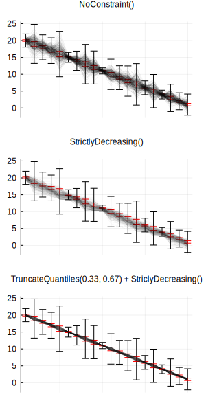

# Strictly decreasing

The default constructor for a strictly decreasing sequential sampling constraint is 
`StrictlyDecreasing`. To specify how the sequence is sampled, provide an 
`OrderedSamplingAlgorithm` as an argument to the constructor.
## Documentation

```@docs
resample(udata::AbstractUncertainValueDataset, 
        constraint::Union{SamplingConstraint, Vector{SamplingConstraint}},
        sequential_constraint::StrictlyDecreasing{OrderedSamplingAlgorithm};
        quantiles = [0.0001, 0.9999])
```

```@docs 
resample(udata::DT, sequential_constraint::StrictlyDecreasing{T};
        quantiles = [0.0001, 0.9999]) where {DT <: AbstractUncertainValueDataset, T <: StartToEnd}
```

## Compatible ordering algorithms

- `StrictlyDecreasing(StartToEnd())` (the default)

## Examples 

### Example: Strictly decreasing sequences + regular constraints

We'll start by creating some uncertain data with decreasing magnitude and just minor 
overlap between values, so we're reasonably sure we can create strictly decreasing sequences.

```julia
using UncertainData, Plots 
N = 20
u_timeindices = [UncertainValue(Normal, i, rand(Uniform(0.1, ))) for i = N:-1:1]
u = UncertainDataset(u_timeindices)
```

Now, we'll create three different plots. In all plots, we plot the 0.00001th to 0.99999th 
(black) and 33rd to 67th (red) percentile range error bars. For the first plot, we'll 
resample the data without any constraints. For the second plot, we'll resample without 
imposing any constraints on the furnishing distirbution, but enforcing strictly decreasing
sequences when drawing realizations. For the third plot, we'll first truncate all 
furnishing distributions to their 33rd to 67th percentile range, then draw realizations 
whose consecutively value are strictly decreasing in magnitude.

```julia 
# Plot the data with 0.00001th to 0.99999th error bars in both directions
qs = [0.0001, 0.9999]
p_noconstraint = plot(u, qs, legend = false, xaxis = false,
    title = "NoConstraint()") 
p_decreasing = plot(u, qs, legend = false, xaxis = false, 
    title = "StrictlyDecreasing()")
p_decreasing_constraint = plot(u, qs, legend = false, xaxis = false,
    title = "TruncateQuantiles(0.33, 0.67) + StriclyDecreasing()")

# Add 33rd to 67th percentile range error bars to all plots. 
plot!(p_noconstraint, u, [0.33, 0.67], msc = :red)
plot!(p_decreasing, u, [0.33, 0.67], msc = :red)
plot!(p_decreasing_constraint, u, [0.33, 0.67], msc = :red)

for i = 1:300
    plot!(p_noconstraint, resample(u, NoConstraint()), lw = 0.2, lc = :black, lα = 0.2)
    plot!(p_decreasing, resample(u, StrictlyDecreasing()), lw = 0.2, lc = :black, lα = 0.1)
    plot!(p_decreasing_constraint, resample(u, TruncateQuantiles(0.33, 0.67), StrictlyDecreasing()), lw = 0.2, lc = :black, lα = 0.1)
end 

plot(p_noconstraint, p_decreasing, p_decreasing_constraint, link = :x,
    layout = (3, 1), size = (300, 600), titlefont = font(8))
```

