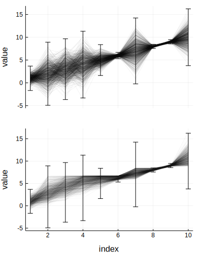
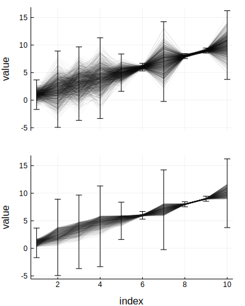

The default constructor for a strictly increasing sequential sampling constraint is 
`StrictlyIncreasing`. To specify how the sequence is sampled, provide an 
`OrderedSamplingAlgorithm` as an argument to the constructor.


## Compatible ordering algorithms

- `StrictlyIncreasing(StartToEnd())` (the default)

# Documentation 


```@docs
resample(udata::AbstractUncertainValueDataset, 
        constraint::Union{SamplingConstraint, Vector{SamplingConstraint}},
        sequential_constraint::StrictlyIncreasing{OrderedSamplingAlgorithm};
        quantiles = [0.0001, 0.9999])
```


```@docs 
resample(udata::DT, sequential_constraint::StrictlyIncreasing{T};
        quantiles = [0.0001, 0.9999]) where {DT <: AbstractUncertainValueDataset, T <: StartToEnd}
```

# Examples

## Example 1: strictly increasing sequences

Let's compare how the realizations look for the situation where no sequential sampling
constraint is imposed versus enforcing strictly increasing sequences.

We start by creating some uncertain data with increasing magnitude and zero overlap between 
values, so we're guaranteed that a strictly increasing sequence through the dataset exists.

```julia
using UncertainData, Plots 


N = 10
u_timeindices = [UncertainValue(Normal, i, rand(Uniform(0.1, 2))) for i = 1:N]
u = UncertainDataset(u_timeindices)

p_increasing = plot(u, [0.0001, 0.9999], legend = false,
    xlabel = "index", ylabel = "value")
p_regular = plot(u, [0.0001, 0.9999], legend = false,
    ylabel = "value", xaxis = false)

for i = 1:1000
    plot!(p_increasing, resample(u, StrictlyIncreasing()), lw = 0.2, lc = :black, lα = 0.1)
    plot!(p_regular, resample(u), lw = 0.2, lc = :black, lα = 0.2)
end 

plot(p_regular, p_increasing, layout = (2, 1), link = :x, size = (400, 500))
```



Values of the realizations where strictly increasing sequences are imposed clearly are 
limited by the next values in the dataset. For the regular sampling, however, realizations 
jump wildly, with both positive and negative first differences.

## Example 2: regular constraints + strictly increasing sequences

You may also combine regular sampling constraints with sequential resampling schemes. 
Here's one example. We use the same data as in example 1 above, but when drawing increasing 
sequences, we only resample from within one standard deviation around the mean.
 
```julia 
p_increasing = plot(u, [0.0001, 0.9999], legend = false,
    xlabel = "index", ylabel = "value")
p_regular = plot(u, [0.0001, 0.9999], legend = false,
    ylabel = "value", xaxis = false)

for i = 1:1000
    plot!(p_increasing, resample(u, TruncateStd(1), StrictlyIncreasing()), lw = 0.2, 
        lc = :black, lα = 0.1)
    plot!(p_regular, resample(u), lw = 0.2, lc = :black, lα = 0.2)
end 

plot(p_regular, p_increasing, layout = (2, 1), link = :x, size = (400, 500))
```


