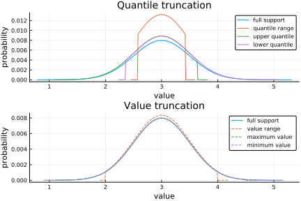

Uncertain values may be constrained in various ways, as visualised by the following example.



Which was generated as follows. Note that the plot recipe normalises the distributions
after constraining the uncertain values.

```julia 
uval = UncertainValue(Normal, 2, 5)

p1 = plot(uval, label = "full support", title = "Quantile truncation")
plot!(constrain(uval, TruncateQuantiles(0.2, 0.8)), label = "quantile range truncation")
plot!(constrain(uval, TruncateUpperQuantile(0.9)), label = "upper quantile truncation")
plot!(constrain(uval, TruncateLowerQuantile(0.1)), label = "lower quantile truncation")

p2 = plot(uval, label = "full support", title = "Value truncation")
plot!(constrain(uval, TruncateRange(2, 4)), ls = :dash, label = "range truncation")
plot!(constrain(uval, TruncateMaximum(4.5)), ls = :dash, label = "maximum value truncation")
plot!(constrain(uval, TruncateMinimum(-2)), ls = :dash, label = "minimum value truncation")

plot(p1, p2, layout = (2, 1), link = :x, xlabel = "value", ylabel = "probability")
```


## Documentation

```@docs
constrain(uv::AbstractUncertainValue, constraint::SamplingConstraint)
```


## Examples

``` julia tab="Theoretical distribution"
using UncertainData, Distributions

# Define an uncertain value furnished by a theoretical distribution
uv = UncertainValue(Normal, 1, 0.5)

# Constrain the support of the furnishing distribution using various
# constraints
uvc_lq = constrain(uv, TruncateLowerQuantile(0.2))
uvc_uq = constrain(uv, TruncateUpperQuantile(0.8))
uvc_q = constrain(uv, TruncateQuantiles(0.2, 0.8))
uvc_min = constrain(uv, TruncateMinimum(0.5))
uvc_max = constrain(uv, TruncateMaximum(1.5))
uvc_range = constrain(uv, TruncateRange(0.5, 1.5))
```

``` julia tab="Theoretical distribution with fitted parameters"
using UncertainData, Distributions

# Define an uncertain value furnished by a theoretical distribution with
# parameters fitted to empirical data
uv = UncertainValue(Normal, rand(Normal(-1, 0.2), 1000))

# Constrain the support of the furnishing distribution using various
# constraints
uvc_lq = constrain(uv, TruncateLowerQuantile(0.2))
uvc_uq = constrain(uv, TruncateUpperQuantile(0.8))
uvc_q = constrain(uv, TruncateQuantiles(0.2, 0.8))
uvc_min = constrain(uv, TruncateMinimum(0.5))
uvc_max = constrain(uv, TruncateMaximum(1.5))
uvc_range = constrain(uv, TruncateRange(0.5, 1.5))
```

``` julia tab="Kernel density estimated distribution"
# Define an uncertain value furnished by a kernel density estimate to the
# distribution of the empirical data
uv = UncertainValue(UnivariateKDE, rand(Uniform(10, 15), 1000))

# Constrain the support of the furnishing distribution using various
# constraints
uvc_lq = constrain(uv, TruncateLowerQuantile(0.2))
uvc_uq = constrain(uv, TruncateUpperQuantile(0.8))
uvc_q = constrain(uv, TruncateQuantiles(0.2, 0.8))
uvc_min = constrain(uv, TruncateMinimum(13))
uvc_max = constrain(uv, TruncateMaximum(13))
uvc_range = constrain(uv, TruncateRange(11, 12))
```
