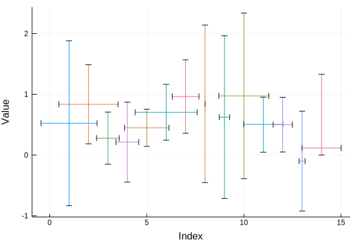

`UncertainIndexValueDataset`s have uncertainties associated with both the 
indices (e.g. time, depth, etc) and the values of the data points.


```@docs 
UncertainIndexValueDataset
```

## Example

Here's an example of how to create an uncertain index-value dataset. Let's start by 
defining the uncertain data values and collecting them in an `UncertainValueDataset`. 

```julia 
using UncertainData, Plots 
gr()
r1 = [UncertainValue(Normal, rand(), rand()) for i = 1:10]
r2 = UncertainValue(rand(10000))
r3 = UncertainValue(Uniform, rand(10000))
r4 = UncertainValue(Normal, -0.1, 0.5)
r5 = UncertainValue(Gamma, 0.4, 0.8)

u_values = [r1; r2; r3; r4; r5]
udata = UncertainDataset(u_values);
```

The values were measures at some time indices by an inaccurate clock, so that the times 
of measuring are normally distributed values with fluctuating standard deviations.

```julia 
u_timeindices = [UncertainValue(Normal, i, rand(Uniform(0, 1))) 
    for i = 1:length(udata)]
uindices = UncertainDataset(u_timeindices);
```

Now, combine the uncertain time indices and measurements into an 
`UncertainIndexValueDataset`.

```julia
x = UncertainIndexValueDataset(uindices, udata)
```

The built-in plot recipes make it easy to visualize the dataset. 
By default, plotting the dataset plots the median value of the index and the measurement 
(only for scatter plots), along with the 33rd to 67th percentile range error bars in both 
directions. 

```julia 
plot(x)
```


You can also tune the error bars by calling 
`plot(udata::UncertainIndexValueDataset, idx_quantiles, val_quantiles)`, explicitly 
specifying the quantiles in each direction, like so:

```julia 
plot(x, [0.05, 0.95], [0.05, 0.95])
```



