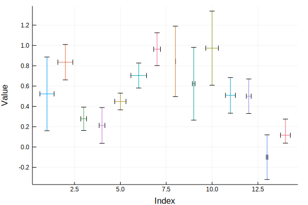

`UncertainIndexValueDataset`s have uncertainties associated with both the index (e.g. time, depth, etc) and the value itself.

Here's an example of how to create an uncertain index-value dataset.

```julia 
using UncertainData, Plots 
gr()
r1 = [UncertainValue(Normal, rand(), rand()) for i = 1:10]
r2 = UncertainValue(rand(10000))
r3 = UncertainValue(Uniform, rand(10000))
r4 = UncertainValue(Normal, -0.1, 0.5)
r5 = UncertainValue(Gamma, 0.4, 0.8)

u_timeindices = [UncertainValue(Normal, i, rand(Uniform(0, 1))) 
    for i = 1:length(udata)]

u_values = [r1; r2; r3; r4; r5]

# A separate UncertainDataset for the data indices and for the data values
uindices = UncertainDataset(u_timeindices);
udata = UncertainDataset(u_values);

# Collect them in an uncertain index-value dataset
x = UncertainIndexValueDataset(uindices, udata)
```

By default, plotting the dataset plots the median value of the index and the measurement (only for scatter plots), 
along with the 33rd to 67th percentile range error bars in both directions. You can stick 
to the defaults by calling `plot(udata::UncertainIndexValueDataset)`.

```julia 
plot(x)
```



Tune the error bars by calling 
`plot(udata::UncertainIndexValueDataset, idx_quantiles::Vector{Float64}, val_quantiles::Vector{Float64})`, explicitly specifying the quantiles in each direction, like so:

```julia 
plot(x, [0.05, 0.95], [0.05, 0.95])
```


