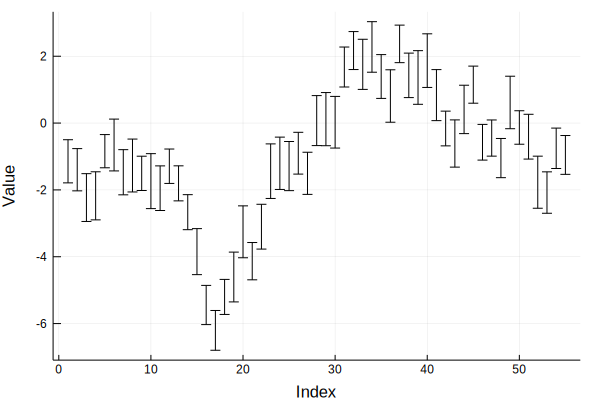

`UncertainDataset`s have no explicit index associated with its uncertain values. This page shows how to construct such datasets.

## Example 1
Let's create a random walk and pretend it represents fluctuations in the mean
of an observed dataset. Assume that each data point is normally distributed,
and that the $i$-th observation has standard deviation $\sigma_i \in [0.3, 0.5]$.

Representing these data as an `UncertainDataset` is done as follows:

```julia 
using UncertainData, Plots

# Create a random walk of 55 steps
n = 55
rw = cumsum(rand(Normal(), n))

# Represent each value of the random walk as an uncertain value and
# collect them in an UncertainDataset
dist = Uniform(0.3, 0.5)
uncertainvals = [UncertainValue(Normal, rw[i], rand(dist)) for i = 1:n]
D = UncertainDataset(uncertainvals)
```

By default, plotting the dataset will plot the median values (only for scatter plots) along with the 33rd to 67th
percentile range error bars. 

```
plot(D)
```


You can customize the error bars by explicitly providing the quantiles:

```
plot(D, [0.05, 0.95])
```

