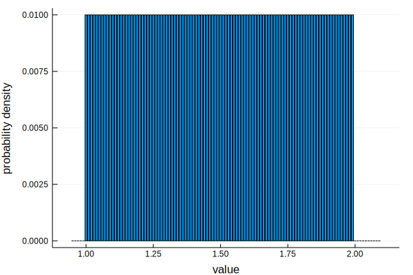

This packages facilitates working with datasets with uncertainties. The core concept of `UncertainDatasets` is to replace an uncertain data value with a probability distribution describing the point's uncertainty.


There are currently three ways of doing that: by [theoretical distributions](uncertainvalues_theoreticaldistributions.md),
[theoretical distributions with parameters fitted to empirical data](uncertainvalues_fitted.md), or
[kernel density estimations to the distributions of empirical data](uncertainvalued_kde.md). Check out the examples below
and the documentation in the sidebar!

### Uncertain values defined by theoretical distributions

First, load the necessary packages:

```julia
using UncertainData, Distributions, KernelDensity, Plots
```

#### A uniformly distributed uncertain value
Now, consider the following trivial example. We've measure a data value with a poor instrument that tells us that the value lies between `-2` and `3`. However, we but that we know nothing more about how the value is distributed on that interval. Then it may be reasonable to represent that value as a uniform distribution on `[-2, 3]`.

Define the uncertain value:

```julia
u = UncertainValue(Uniform, 1, 2)

# Plot the estimated density
bar(u, label = "", xlabel = "value", ylabel = "probability density")
```





#### A normally distributed uncertain value

Another common example is to use someone else's data from a publication. Usually, these values are reported as the mean or median, with some associated uncertainty. Say we want to use an uncertain value which is normally distributed with mean `2.1` and standard deviation `0.3`.


```julia
u = UncertainValue(Normal, 2.1, 0.3)

# Plot the estimated density
bar(u, label = "", xlabel = "value", ylabel = "probability density")
```


### Uncertain values defined by kernel density estimated distributions

One may also be given a a distribution of numbers that's not quite normally distributed. How to represent this uncertainty? Easy: we use a kernel density estimate to the distribution.

In the following example, we generate some random numbers from a mixture of two normal distributions.


```julia
M = MixtureModel([Normal(-5, 0.5), Normal(0.2)])
u = UncertainValue(UnivariateKDE, rand(M, 250))

# Plot the estimated distribution.
plot(u, xlabel = "Value", ylabel = "Probability density")
```


### Uncertain values defined by theoretical distributions fitted to empirical data

One may also be given a dataset whose histogram looks a lot like a theoretical
distribution. We may then select a theoretical distribution and fit its
parameters to the empirical data.

In the example below, we [resample](../resampling/resampling_uncertain_values.md)
the estimated distribution to obtain a histogram we can compare to the original
data.

```julia
# Take a sample from a Gamma distribution with parameters α = 1.7 and θ = 5.5
some_sample = rand(Gamma(1.7, 5.5), 2000)
uv = UncertainValue(Gamma, some_sample)
p1 = histogram(some_sample, normalize = true,
    fc = :black, lc = :black,
    label = "", xlabel = "value", ylabel = "density")

# Resample the fitted theoretical distribution
p2 = histogram(resample(uv, 10000), normalize = true,
    fc = :blue, lc = :blue,
    label = "", xlabel = "value", ylabel = "density")

plot(p1, p2, layout = (2, 1), link = :x)
```

As expected, the histograms closely match (but are not exact because we estimated
the distribution using a limited sample).


