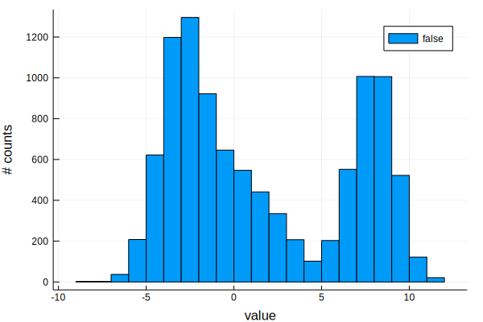

# Uncertain value from KDE estimate

```
UncertainValue(::UnivariateKDE, ::Vector)
```

Representing uncertain values by a kernel density estimate is appropriate when
data have an empirical distribution that doesn't follow any obvious theoretical distribution.

To visualize this, let's create a bimodal distribution, then sample 10000
values from it.

```julia
using Distributions

n1 = Normal(-3.0, 1.2)
n2 = Normal(8.0, 1.2)
n3 = Normal(0.0, 2.5)

# Use a mixture model to create a bimodal distribution
M = MixtureModel([n1, n2, n3])

# Sample the mixture model.
samples_empirical = rand(M, Int(1e4));
```



It is not obvious which distribution to fit to such data.

A kernel density estimate, however, will always be a decent representation
of the data, because it doesn't follow a specific distribution and adapts to the data values.

To create a kernel density estimate, simply call the `UncertainValue(v::Vector{Number})` constructor with
a vector containing the sample:


```julia
uv = UncertainValue(samples_empirical)
```

The plot below compares the empirical histogram (here represented as a density plot) with our kernel density estimate.

```julia
using Plots, StatPlots, UncertainData
uv = UncertainValue(samples_empirical)
density(mvals, label = "10000 mixture model (M) samples")
density!(rand(uv, Int(1e4)),
    label = "10000 samples from KDE estimate to M")
xlabel!("data value")
ylabel!("probability density")
```


### Additional keyword arguments and examples

If the only argument to the `UncertainValue` constructor is a vector of values,
the default behaviour is to represent the distribution by a kernel density
estimate (KDE), i.e. `UncertainValue(data)`. Gaussian kernels are used by default. The syntax
`UncertainValue(UnivariateKDE, data)` will also work if `KernelDensity.jl` is
loaded.

``` julia tab="Implicit KDE constructor"
using Distributions, UncertainData

# Create a normal distribution
d = Normal()

# Draw a 1000-point sample from the distribution.
some_sample = rand(d, 1000)

# Use the implicit KDE constructor to create the uncertain value
uv = UncertainValue(v::Vector)
```

``` julia tab="Explicit KDE constructor"
using Distributions, UncertainData, KernelDensity

# Create a normal distribution
d = Normal()

# Draw a 1000-point sample from the distribution.
some_sample = rand(d, 1000)

# Use the explicit KDE constructor to create the uncertain value.
# This constructor follows the same convention as when fitting distributions
# to empirical data, so this is the recommended way to construct KDE estimates.
uv = UncertainValue(UnivariateKDE, v::Vector)
```

``` julia tab="Changing the kernel"
using Distributions, UncertainData, KernelDensity

# Create a normal distribution
d = Normal()

# Draw a 1000-point sample from the distribution.
some_sample = rand(d, 1000)

# Use the explicit KDE constructor to create the uncertain value, specifying
# that we want to use normal distributions as the kernel. The kernel can be
# any valid kernel from Distributions.jl, and the default is to use normal
# distributions.
uv = UncertainValue(UnivariateKDE, v::Vector; kernel = Normal)
```

``` julia tab="Adjusting number of points"
using Distributions, UncertainData, KernelDensity

# Create a normal distribution
d = Normal()

# Draw a 1000-point sample from the distribution.
some_sample = rand(d, 1000)

# Use the explicit KDE constructor to create the uncertain value, specifying
# the number of points we want to use for the kernel density estimate. Fast
# Fourier transforms are used behind the scenes, so the number of points
# should be a power of 2 (the default is 2048 points).
uv = UncertainValue(UnivariateKDE, v::Vector; npoints = 1024)
```
